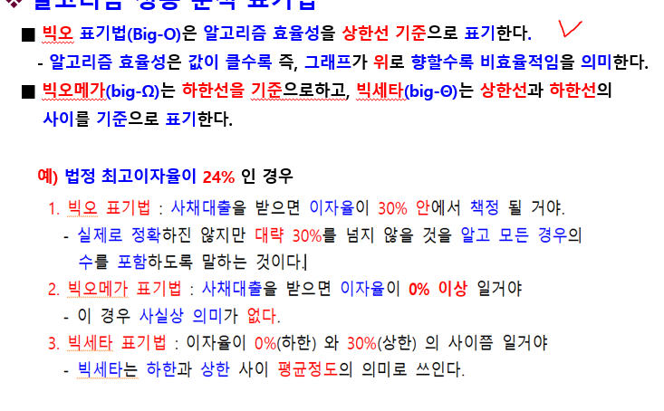
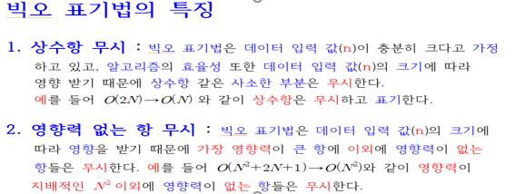
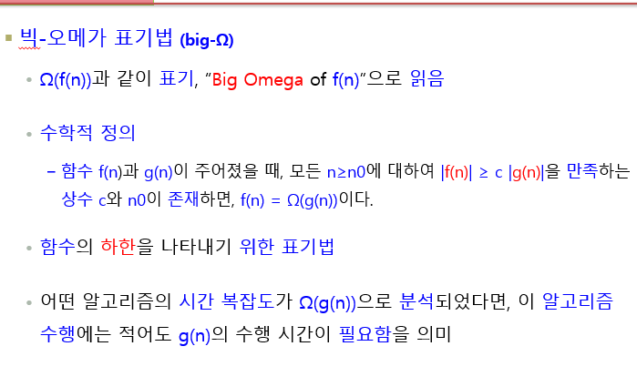

# 알고리즘 성능 표기법

-------

------

# 빅오 표기법

    O(1) : 입력값에 상관없이 일정한 실행시간을 최고!의 알고리즘이라 할 수 있다. 하지만 상수 시간에 실행된다 해도 상수값이 상상 이상으로 클 경우 사실상 일정한 시간의 의미가 없다. 최고의 알고리즘이 될 수 있지만 그만큼 신중해야 한다.

    O(log n) : 로그는 매우 큰 입력값에서도 크게 영향을 받지 않는 편이다. 매우 견고한 알고리즘으로 이진 탐색의 경우가 이에 해당한다.

    O(n) : 알고리즘을 수행하는데 걸리는 시간은 입력값에 비례한다. 이러한 알고리즘을 선형 시간 알고리즘이라 부른다. 정렬되지 않은리스트에서 최대 또는 최솟값을 찾는 경우가 해당되며 모든 입렵값을 적어도 한 번 이상은 살펴봐야 한다.

    O (n log n) : 병합 정렬등의 대부분 효율이 좋은 알고리즘이 이에 해당 한다. 아무리 좋은 알고리즘이라 할지라도 n log n 보다 빠를 수 없다. 입력값이 최선일 경우, 비교를 건너 뛰어 O(n)이 될 수 있다.

    O(n^2)  : 버블 정렬 같은 비효율저긴 정렬 알고리즘이 이에 해당 한다.

    O(2^n) : 피보나치의 수를 재귀로 계산하는 알고리즘이 이에 해당 한다. n^2와 혼동되는 경우가 있는데 2^n이 훨씬 더 크다.

    O(n!) : 가장 느린 알고리즘으로 입력값이 조금만 커져도 계산이 어렵다.