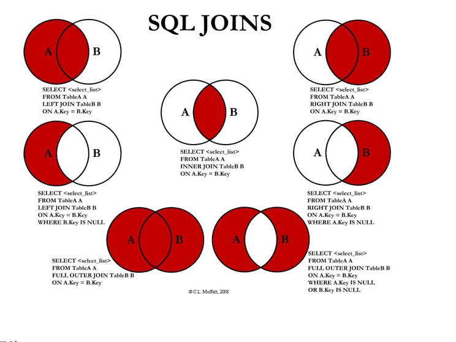

# DDL (Data Definition Language)

데이터 정의어란? 데이터베이스를 정의하는 언어이며, 데이터를 생성, 수정, 삭제하는 등의 데이터의 전체의 골격을 결정하는 역할을 하는 언어이다.

* CREATE : 데이터베이스, 테이블등을 생성
* ALTER : 테이블을 수정
* DROP : 데이터베이스, 테이블을 삭제
* TRUNCATE : 테이블을 초기화

# DML (Data Manipulation Language) 

데이터 조작어란? 정의된 데이터베이스에 입력된 레코드를 조회하거나 수정하거나 삭제하는 등의 역할을 하는 언어.

# DCL (Data Control Langauge)

# SELECT : 데이터 조회

``` sql
SELECT * FROM TABLE;
```    

``` sql
SELECT COUNT(*) CNT FROM TABLE;
```    

``` sql
SELECT * FROM TargetTable
WHERE TargetField IS NULL
```    

``` sql
    SELECT * FROM TargetTable
    WHERE TargetField IS NOT NULL
```    


# INSERT : 데이터 삽입

# UPDATE : 데이터 수정

    ex)
    UPDATE TABLE SET 
        스키마 = 변경점
    WHERE ROW LIKE"특정조건";

DELETE : 데이터 삭제

    ex)
    
    

# DCL (Data Control Language) 

데이터베이스에 접근하거나 객체에 권한을 주는등의 역할을 하는 언어

* GRANT : 특정 데이터베이스 사용자에게 특정 작업에 대한 수행 권한을 부여
* REVOKE : 특정 데이터베이스 사용자에게 특정 작업에 대한 수행 권한을 박탈, 회수
* COMMIT : 트랜잭션의 작업을 저장
* ROLLBACK : 트랜잭션의 작업을 취소, 원래대로 복구

# join이란

* 내부 조진 (INNER JOIN)
    1. 교차 조인 (CROSS JOIN  - CARTESIN JOIN)
    2. 등가/동등/동일 조인(EQUI JOIN)
    3. 비등가 조인(NON-EQUI JOIN)
    4. 자연 조인 (NATURAL JOIN)

* 외부 조인 (OUTER JOIN)
    1.완전 외부 조인 (FULL OUTER JOIN)
    2.왼쪽 (LEFT OUTER)
    3.오른쪽 (RIGHT OUTER)

    4. 셀프 조인 (SELF JOIN)
    5. 안티 조인 (ANTI JOIN)
    6. 세미 조인 (SEMI JOIN)




# ORDER BY 

* 사용자가 원하는 순서로 출력해주는 것
* 오름차순:ASC
* 내림차순:DESC

# INSET VS UPDATE VS ALTER

|명령어|차이|
|---|---|
|INSERT|기존 테이블에 새 행을 삽입하는데 사용|
|UPDATE|기존 레코드를 업데이트 하는데 사용|
|ALTER|기존 테이블에 열을 수정, 삭제 또는 추가하는데 사용|
