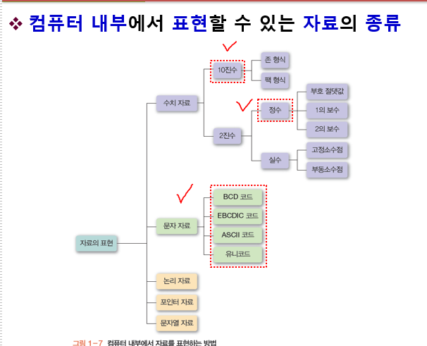
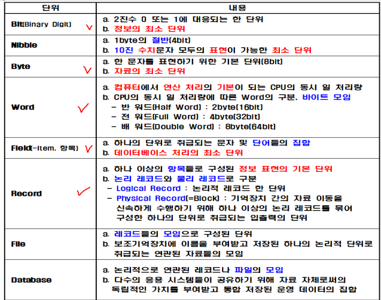

# 자료구조 표현

# 자료구조의 표현단위

# 유니코드

아스키코드의 경우, 128개의 코드가 정리되어 있는 코드표가 있다.  
EUC-KR/CP949의 경우, 2바이트로 표현할 수 있는 코드표가 있는 것이다.  
UTF-8/UTF-16등의 인코딩은 U+로 시작되는 코드표가 존재하고, 이를 유니코드라고 말한다. UTF같은 인코딩은 같은 유니코드표를 가지고 다르게 표현하는 방법인 것이다.  

(참조: 위의 '안'을 UTF16LE로 표현하면 ff fe 48 c5 가 된다. 물론 유니코드표에서 찾으면 U+C548으로 같다. 어? 아까 UTF-16은 2바이트라고 했는데 왜 4바이트이지? 이것은 추후 다룰 UTF-16 인코딩 방식의 특성 때문이다.)

추가내용: UTF-16과 UTF-32 인코딩은 LE(Little-Endian) 또는 BE(Big-Endian)과 같은 엔디안 속성을 가진다. 
ff fe 라는 문자열을 통해 이 인코딩이 LE인지 BE인지 구별하게 된다.

Big-Endian의 경우에는 FE FF 로 표현하고 Little-Endian의 경우에는 FF FE로 표현한다.

참고로 UTF-32는 4바이트로 표현해야하기 때문에, 이 마저도 4바이트 (FFFE 0000)로 표현된다.