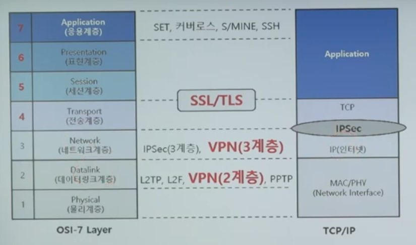
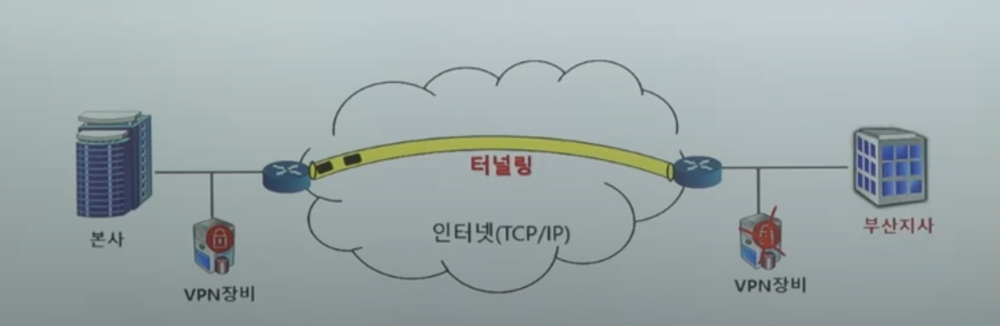

# VPN(Virtual Private Network)이란?

* 가상사설망 인터넷망과 같은 공중망을 사설망처럼 이용해 회선비용을 크게 절감할 수 있는 기업통신 서비스
* 일반적으로 안전하지 않은 공용 네트워크를 이용하여 사설 네트워크를 구성하는 기술로서,  
전용선을 이용한 사설 네트워크에 비해 저렴한 비용으로 안전한 망을 구성 가능하다
* 공용 네트워크로 전달되는 트래픽은 암호화 및 메시지 인증 코드 등을 사용하여 기밀성과 무결성을 제공
* TCP/IP 기반의 개방형 네트워크인 인터넷에서 한 네트워크에서 다른 네트워크로 이동하는 모든 데이터 정보를 암호화하여 사설망 기능을 제공하기 위해 도입된 기능

# VPN 종류 

* VPN 기술 중 SSL 프로토콜은 응용계층과 전송계층 사이에 위치
* VPN 기술 중 IPSec 프로토콜은 네트워크 계층의 보안성을 제공해주는 표준화된 프로토콜이다.
* 3계층에서 동작하는 VPN과 2계층에서 동작하는 VPN이 있다.
* PPTP, L2F, L2TP는 2계층에서 동작하는 터널링 기술이다.

# VPN 특징

## 보안
* VPN은 방화벽, 침입 탐지 시스템(IDS)과 함께 현재 사용되는 가장 일반적인 보안 솔루션 중 하나
* 사용자들 간의 안전한 통신을 위하여 기밀성, 무결성, 사용자 인증의 보안 기능을 제공
* 사용자가 필요에 따라 자체적인 보안성을 적용한 네트워크를 구축 가능
    * IPSec이나 TLS/SSL 등의 보안 프로토콜을 네트워크 관리자의 구성이 아닌 사용자의 요구로 적용가능함

## 비용
* 한달에 몇 만원이면 이용할 수 있는 인터넷 회선을 고가의 임대회선과 비슷하게 사용해 줄 수 있도록 해주는 솔루션 
    * 다만 이를 위해 VPN이 임대회선과 비슷한 수준의 기밀성을 제공하기위해 별도의 암호화를 해야된다.
* 이미 구축되어 있는 사설망과의 연결, 모바일 환경, 외부와의 보안통신이 가능해서 추가적인 구축비용 부담이 적음    
    * 즉 별도의 전용선을 사용하는 사설망에 비해 싸다는 이야기
## 기능
* 인터넷과 같은 공공 네트워크를 통해 기업의 재택근무나 이동 중인 직원이 안전하게 회사 시스템에 접근할 수 있도록 해줌

## 구현방식
* VPN은 네트워크 종단점 사이에 가상터널이 형성되도록 하는 터널링 기능은 SSH와 같은 OSI 응용계층의 보안 프로토콜로 구현해야한다

## 분류방식
* 지사 간 연결(Branch Office Interconnection or Intranet)
    * 본사와 지점들 사이에서 통신을 가능하게 하는 VPN의 기능
    * 두 개의 신뢰성 있는 망간의 신뢰성 연결을 제공

* 회사 간 연결(Inter Company Connection or Extranet)
    * 다른 회사의 인트라넷과 보안 통신을 가능하세 하는 VPN의 기능
    * 본사와 비즈니스 파트너들 간의 연결을 제공

* 원격 접근(Remote Access)
    * 재택근무를 하는 직원과 내부 인트라넷 사이에 통신을 가능하게 하는 VPN 기능
    * 기업과 원격지 사용자 간의 연결을 제공

# 보안 기술
* 데이터암호화 기술(대칭키 사용): 데이터의 기밀성을 보장하기 위한 암호화, 복호화 기술
* 무결성 보장: 무결성을 확인하기 위해 MAC(Massage Authentication Code: 메세지 인증코드)를 사용

# 터널링 기술

[Tunneling](./tunneling.md)

* 공중망에서 전용선과 같은 보안효과를 얻기 위한 기술
* VPN기술 중 터널링 기술은 VPN의 기본이 되는 기술, 터미널이 형성되는 양 호스 사이에 전송되는 패킷을 추가헤더 값으로 인 캡슐화하는 기술이다
  (IPSec 터널링은 OSI 3계층 암호화 기술)
* 인증 기술: 접속요청자의 적합성을 판단하기 위한 인증기술
* 접근제어 기술: 적절한 권한을 가진 인가자만 특정 시스템이나 정보에 접근할 수 있도록 통제하는것

# VPN 장단점

* 장점
    * 비용이 적게듬
    * Network 관리 및 운영 비용 절감
    * 기업 netowrk의 유동성 확보
    * 기업의 통신 비용 절감
* 단점
    * VPN 장비간의 호환성
    * 관리 편의성
    * [QoS](../qos.md) 보장 및 표준화
    * 인터넷의 성능 불안정
