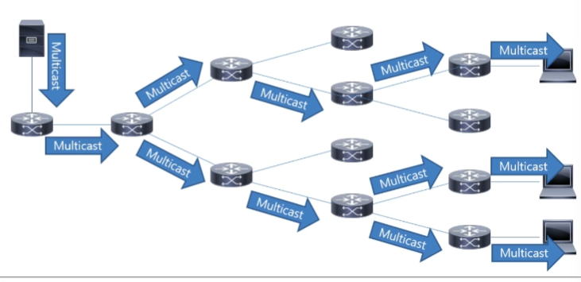

# Multicast란?

* 받고자 하는 장비들한테만 해당 패킷을 보냄
* 장비가 많으면은 패킷을 카피해서 여러방향으로 보낸다.
* 하나의 패킷만 보내도 여러 사용자에게 동일한 패킷을 보낼수가 있다.
* 전송이 지원되면 데이터의 중복 전송으로 인한 네트워크 자원 낭비를 최소화 할 수 있다.  

# Multicast Routing

* 

# L2
L2에선 멀티캐스트는 거의 브로드캐스트와 비슷하다.