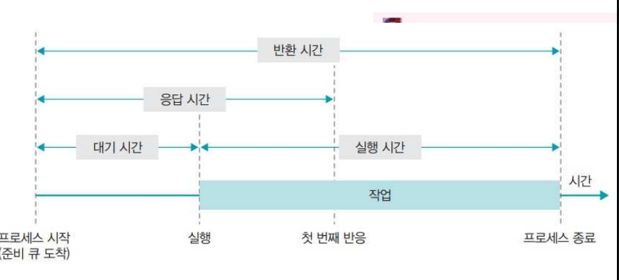

# 스케줄링(Scheduling)

* 정의
    * 프로세스들에 대하여 CPU에 할당 기회를 결정하고 수행하는 과정이다
    * 프로세스가 작업을 처리하기 위해 CPU 할당을 위한 일정을 처리를 해준다.
* 목적
    * 공정성
    * 처리율 증가
    * cpu 이용률 증가
    * 우선순위 제도: 우선순위가 높은 프로세스를 먼저 실행한다. 
    * 오버헤드 최소화
    * 응답 시간(Response 반응시간) 최소화
    * 반환 시간 최소화
    * 대기 시간 최소화
    * 균형 있는 자원의 사용
    * 무한 연기 회피

# 스케줄링의 성능 평가

*** 높아야 좋은것 ***
1. CPU 이용률 
2. 처리 능력(Throughput) 

*** 낮아야 좋은것 ***

1. 대기 시간
    * 프로세스가 생성된 후 실행되기 전 까지 대기하는 시간
2. 응답 시간
    * 첫 작업을 시작한 후 첫 번째 출력(반응)이 나오기까지의 시간
3. 실행 시간
    * 프로세스 작업이 시작된 후 종료 되기까지의 시간
4. 반환 시간
    * 대기 시간을 포함하여 실행이 종료될 때까지의 시간 

# 스케줄러란?

    어떤 프로세스에게 자원을 할당할지를 결정하는 운영체제 커널의 모듈을 지칭

# 스케줄러의 종류

장기 스케줄러 (= 작업 스케줄러)

    어떤 프로세스를 준비 큐에 삽입할지 결정 (메모리와 디스크 사이의 스케줄링을 담당)
    디스크에서 하나의 프로그램을 가져와 커널에 등록하면 프로세스가 되는데, 이때 디스크에서 어떤 프로그램을 가져와 커널에 등록할지(준비 큐에 등록할지) 결정
    수십 초 내지 수 분 단위로 가끔 호출되므로 상대적으로 느린 속도를 허용

    프로세스의 상태 : new -> ready (in memory)

단기 스케줄러 (= CPU 스케줄러)

     준비 상태의 프로세스 중에서 어떤 프로세스를 다음 순서로 실행할 것인지 결정 (cpu와 메모리 사이의 스케줄링을 담당)
    일반적으로 스케줄러 = 단기 스케줄러
    단기 스케줄러는 미리 정한 스케줄링 알고리즘에 따라 cpu를 할당할 프로세스를 선택
    단기 스케줄러는 밀리 세컨드(ms) 이하의 시간 단위로 매우 빈번하게 호출 -> 수행 속도가 충분히 빨라야 함

    프로세스의 상태 : ready -> running -> waiting -> ready

 중기 스케줄러

    너무 많은 프로세스에게 메모리를 할당해서 시스템의 성능이 저하되는 경우 이를 해결하기 위해 메모리에 적재된 프로세스의 수를 동적으로 조절하기 위해 추가된 스케줄러
    메모리에 많은 수의 프로세스가 적재하면 프로세스 당 보유하고 있는 메모리량이 극도로 적어짐
    CPU 수행에 당장 필요한 프로세스의 주소 공간조차도 메모리에 올려놓기 어려운 상황이 발생
    디스크 I/O가 수시로 발생
    시스템의 성능이 심각하게 저하됨
    메모리에 올라와 있는 프로세스 중 일부의 메모리를 통째로 빼앗아 그 내용을 디스크의 스왑 영역에 저장

    -> 스왑 아웃(swap out)

    중기 스케줄러의 등장으로 프로세스의 상태에는 중지 상태가 추가되었으며, 중지 상태의 프로세스는 메모리를 통째로 빼앗기고 디스크로 스왑 아웃된다.
    중지 준비 상태 : 준비 상태의 프로세스가 중기 스케줄러에 의해 디스크로 swap out
    봉쇄 중지 상태 : 봉쇄 상태의 프로세스가 중기 스케줄러에 의해 디스크로 swap out

    중지 봉쇄 상태이던 프로세스가 봉쇄 되었던 조건을 만족하게 되면 이 프로세스의 상태는 중지 준비 상태로 바뀌게 된다 중지 상태에 있는 프로세스들은 중지 준비 상태이든 중지 봉쇄 상태이든 관계없이 메모리를 조금도 보유하지 않고 디스크에 통째로 스왑 아웃된 상태로 존재하게 된다.
    프로세스의 상태 : ready -> suspended
