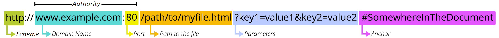

# URL(Uniform Resource Locator)

    웹에 지정된 데이터를 불러오는데 사용하는 주소
 

# Scheme

* 스키마는 브라우저가 자원을 요청하기위해 사용하는 프로토콜을 나타낸다.
* 일반적으로 HTTP, HTTPS를 사용하지만 다른 특수한 프로토콜도 사용할수 있다.

ex) FTP, mailto, etc...

# Authority

* Domain
    * 도메인은 요청중인 웹페이지를 나타낸다
    * 보통 도메인 네임으로 사용하지만 ip 주소로도 사용하기도 한다.
    * 로컬환경에서는 로컬서버를 열어서 localhost로 웹에 들어갈수도 있다.
* Port
    * 포트는 보통 웹 서버를 활성화한 포트로 접속하면 열리는데 
    일반적으로 포트번호를 입력하지않으면 443(https)포트로 접속한다.

ex) google.com == https://google.com:443

# Path to resource 

* Path to resource
    * 웹서버 파일이나 애플리케이션에 대한 경로

# Parameters(query)
* Parameters(qeury)
    * 앰퍼샌드(&)로 구분된 키=값 쌍 형식으로 웹 서버에 전달하는 데이터
    * ?로 쿼리의 시작을 알리고 &로 구분함

ex) ?username=hello&password=1234

참고 : https://developer.mozilla.org/en-US/docs/Learn/Common_questions/What_is_a_URL

# Anchor

* Anchor
    * 웹이나 앱에 자원에 대한 북마크
    * Anchor가 정의된 위치에 이동하거나, 동영상의 특정시간으로 이동하는 등  이러한 특정 행위에 대한 값을 서버에 전달하는 역할

# 여담

    url은 view-source:https://google.com
    같이 맨 앞에 "view-source:"를 붙히면은 html 소스를 간단하게나마 볼수가 있다.
    하지만 css, js같은 특수 기능을 하는 소스들은 볼수가 없으니 다른방법을 추천한다.

# URI의 원소

# URI(Uniform Resource Identifier)

* 통합자원 식별자
* 인터넷 서비스를 전제로한 인터넷상의 통일된 정보 자원의 식별체계
* URI의 존재는 인터넷에서 요구되는 기본 조건으로서 인터넷 프로토콜에 항상 붙어다닌다.
 

# URL (Uniformed Resource Locator)

* 위치지정자
* 프로토콜 포함
* 해당 자원의 위치, Path를 의미
* 일반적으로 사이트 도메인을 자주 의미함.
* 웹 상 뿐만 아니라 컴퓨터 네트워크상의 자원은 모두 나타낼 수 있다.

# URN (Uniformed Resource Name)

* 프로토콜 포함 X
* 해당 자원의 이름을 의미
* 독립적인 자원 지시자
* Page 이후 부분까지 포함

