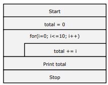

# IPT(Improved Programming Technique)
* 주요 목적 :
    * 개발자의 생산성을 향상
    * 프로그램의 품질을 향상 -> 유지보수 용이
    * 프로그램의 표준화 -> 개인 격차 해소, 교대근무, 인수인계 용이
    * 프로그램의 가독성 향상
    * 경제적인 개발 및 유지보수

* 기술적 기법
    * 설계 분야: 복합 설계(Composite Design)
    * 코딩 분야: 구조적 프로그래밍(Structured Program)
    * 테스트 분야: 하향식 프로그래밍(Top-Down Programming)
        * 지원 요소 :
        * N-S Chart
        * 프로그램 기술 언어(PDL: Program Description Language) 또는 의사 언어(Pseudo Language)
        * HIPO(Hierarchy plus Input Process Output)
        * 모듈 설계(Module Design)
* 관리적 기법
    * 개발 조직 : 선임 프로그래머 팀(Chief Programmer Team)
    * 품질 관리 :
        * 구조적 검토회(Walk-Through)
        * 검증회(Inspection)
        * 라이브러리(Library)
# 기술적 기법
* 복합(Composite) 설계
* 구조적(Structured) 프로그램
* 하향식(Top-Down) 프로그래밍
* N-S(Nassi-Scheiderman) Chart
* 프로그램 기술 언어(PDL : Program Description Language)
* HIPO(Hierarchy plus Input Process Output)
* 모듈(Module) 설계

## 복합(Composite) 설계
* 상세설계단계에 해당
* 구조(Structural) 설계 또는 기능(Functional) 설계하고도 함
* 프로그램의 각 기능을 상세화된 계층 구조로 하여 하향식으로 모듈화

## 구조적(Structured) 프로그램 [1/2]
* 프로그램의 구조를 단순하게 하기 위한 기법
* 이해와 수정이 쉬움
* 정확성을 검증하기 쉬움
* 결과 : 제어 구조가 명확한 프로그램 제작이 가능
* 구조 종류 :
    * 순차(Sequence, 순서) 구조 : 기술된 명령문을 순서대로 수행하는 구조
    * 조건(Condition, Selection) 구조 : 일련의 동작 중 조건에 따라 두 가지 이상의 경우 중 한 가지만 선택하여 수행하는 구조
    * 반복(Iteration, Repetition) 구조 : 조건에 따라 임의 동작들을 반복 실 행하는 구조

## 구조적(Structured) 프로그램 특징 [2/2]
* Dijkstra가 제안
* GOTO 문 배제를 통한 프로그램의 가독성 향상
* 논리적 구조를 명확화
* 쉬운 유지보수
* 프로그램 검증 용이
* 신뢰성과 생산성 향상
* 프로그래밍의 효율성 증진
* 하나의 입력을 통한 하나의 출력을 갖도록 설계

# 기술적 기법
* N-S(Nassi-Scheiderman) Chart
    * 절차적인 논리적 흐름을 BOX 모양으로 표시
    * 시각적 표현을 중심으로 한 기법
    * 주요 특징 :
        * 화살표가 없음
        * 분기 및 반복 구조를 시각적으로 표시
        * 기능 표현보다는 논리적 표현을 중요시함
        * 순차, 선택, 반복, 케이스 제어 구조를 가짐
        * 구조적 코딩이 용이

# 프로그램 기술 언어(PDL : Program Description Language)
    * 의사코드(Pseudo Code)라고도 함
    * 제한된 단어, 제어 조건, 문장을 이용하여 자연어 형식으로 기술
    * 하향식으로 상세화

# HIPO(Hierarchy plus Input Process Output) [1/2]
    * 문서화와 설계의 효율성을 강화
    * 표준화된 문서 작성 기법을 사용
    * 프로그램의 기능을 계층 구조로 도식화
    * 하향식(Top-Down) 기법
    * 기능과 자료의 의존 관계를 동시에 표현
    * 기능 중심 설계
    * IPO(입력, 처리, 출력)의 기능을 명확히 설계
    * 도식 목차(Visual Table of Contents), 총괄 다이어그램(Overview Diagram), 상세 다이어그램(Detail Diagram)으로 표현

* HIPO(Hierarchy plus Input Process Output) [2/2]
    * 도식 목차(Visual Table of Contents)
        * 시스템이나 프로그램을 여러 기능으로 분해
        * 분해된 기능 간 관계와 계층 구조를 도표(계층도), 범례 (Legend), 보충 설명란(Extended Description)로 표시
    * 총괄 다이어그램(Overview Diagram)
        * 개괄적인 기능을 IPO의 형태로 나타냄
    * 상세 다이어그램(Detail Diagram)으로 표현
        * 상세 사항을 IPO의 형태로 나타냄

# 모듈(Module) 설계 특징
* 프로그램을 여러 개의 작은 단위(모듈, module, 서브루틴)들로 구성
* 모듈은 독립적으로 컴파일 가능
* 다른 모듈의 호출에 의해 종속적으로 실행
* 재사용 가능
* 유사 업무들에 대해 부품처럼 공통 사용가능
* 분담 작성이 가능
* 메모리를 효율적으로 사용할 수 있음

* 모듈(Module) 설계 유의 사항
    * 적절한 크기(size)로 작성
    * 모듈내 응집도(Cohesion)는 되도록 강하게 설계
    * 모듈간 결합도(Coupling)는 약하게 설계
    * 다른 곳에서도 적용이 가능하도록 표준화
    * 가독성 고려

* 모듈(Module) 설계 효과
    * 개발 시 시간과 노동력 절감
    * 비용 절감
    * 신뢰도 향상
    * 복잡성 해결
    * 이해 용이

# 관리적 기법
* 선임 프로그래머 팀(Chief Programmer Team)
    * 생산성과 품질 향상을 위한 개발 조직의 구성 방법
    * 선임프로그래머(Chief Programmer) : 팀의 대표자로써 설계, 코딩, 테스팅에도 참여 가능
    * 백업프로그래머(Back-up Programmer) : 선임프로그래머 임무 대행
    * 라이브러리언(Librarian) : 프로그램 리스트, 설계 문서, 테스트 계획 등을 관리하는 프로그래머
* 구조적 검토회(Structured Walk-Through)
    * 오류 및 문제를 조기 발견하기 위한 소프트웨어 관리 기법
* 검증회(Inspection)
    * 오류를 문서화, 오류 관리용 데이터를 사용하여 관리하는 기법
* 라이브러리(Library)
    * 공통적인 사항들을 라이브러리로 만듦
    * 개개인의 업무 중복 회피 및 생산성 향상
