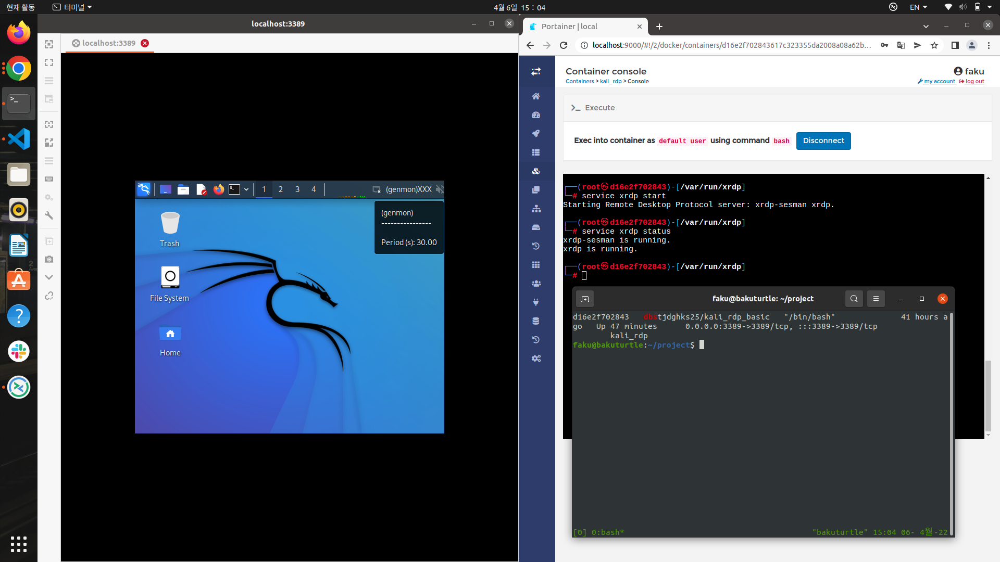

# Docker kali_rdp

* based images -> kali_rolling

user =  root
----

password = 1234
----

# docker images pull

```bash
sudo docker pull dbstjdghks25/kali_rdp_basic
```
# create container

```bash
sudo docker run --name kali_rdp  -p 3389:3389 -it dbstjdghks25/kali_rdp_basic /bin/bash
```
# container port reconnect

```bash
sudo docker start  dbstjdghks25/kali_rdp_basic
```

# container bash shell connect

```bash
sudo docker exec -it dbstjdghks25/kali_rdp_basic /bin/bash
```
# rdp server on

```zsh
service xrdp restart
```

# Demonstration result

