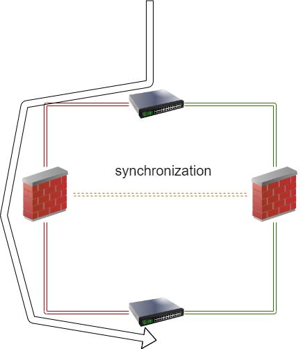
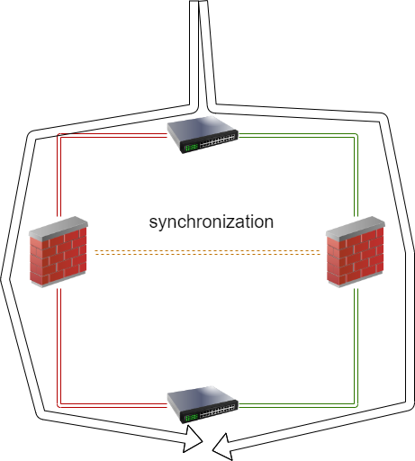
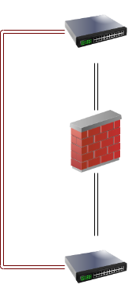
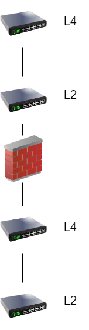
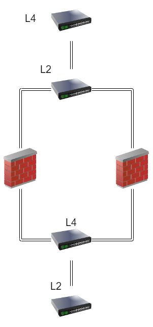

# 고 가용성 방화벽 설계디자인

기본적으로 방화벽도 장비이기에 성능상의 이슈와 기능고장, 공격으로 인한 장비가 먹통이 되는 등 다영한 경우가 있기 때문이다.
그렇기에 동기화된 설정을 가진 같은 장비로 트래픽을 넘길수 있는 아키텍쳐를 설계하는것이다.
당연하겠지만 이러한 장비들은 한개 한개가 고가의 장비이고 Anti-Ddos, WAF, L2, L3,L4 스위치, IDS, IPS 등 
수많은 장비들이 필요하기에 더더욱 복잡해지고 비용이 많이 들어가게된다

# 방화벽 이중화 (Firewall Duplication)

방화벽 이중화는 방화벽에 failover를 통하여 가용성을 높히기위해 사용하는 방법이다.  

# (AS)Active by Standard
  
한대의 방화벽이 죽었을때 다른 방화벽으로 트래픽을 흘려버내는것이다.  
당연하게도 방화벽은 동기화된 상태로 룰을 완전이 공유하고있는데 보통 LACP(Link Aggregation Control Protocol)을 사용하여 맞춰주고 정기적인 룰업데이트(suricata, snort, package)를 시행할떄는 한개만 켜고 한개는 수정하고 이런식으로 유지한다. 
페일오버가 만능처럼보이지만 페일오버를 진행하는동안 연결이 유지되어야하는 게임, 유튜브 등에서 끊김 현상이 발생할수 있다. 

# (AA) Active by Active

로드 벨런싱을 통하여 방화벽의 트래픽을 조절하여 적절하게 방화벽들의 자원을 적절하게 배분하는것이다.  
주의해야될점은 스위치와 방화벽의 호환성이 잘 맞아야한다.  
그리고 당연하게도 트래픽이 방화벽 2개에서 겨우겨우 감당할 수준일떄 하나의 방화벽이 죽어버리는 순간  
가용성이 깨지게 HA가 깨지게 되므로 bypass switch를 통하여 패킷을 넘겨야 하는 상황이 발생할수 있다. 

# Bybass Switch

Bypass Switch란 해커의 공격이나 급속도록 많은 접속률로 인하여 방화벽이 트래픽을 감당할수없을떄 방화벽 윗단에 있는 스위치에   
패킷을 넘기는것을 말한다. 이렇게하면 공격이 방화벽을 넘어서 들어오게되지만 아에 방화벽이 죽어버리는 경우보단 낫기에 이렇게 공격 패킷을 흘려보내는것이다.  

# Full mesh

액티브와 바이패스를 짬뽕시킨 버전으로 비용도 2배이상 들어가는 구조지만 고가용성을 지닌 아키텍쳐이다.  
방화벽을 이중화를 하고 스위치도 이중화를 하며 이것을 윗단에도 적용하는것이다.

# firewall duplication 
  
그외에도 방화벽 이중화 스위치 이중화 등 다양한 방법으로 HA를 유지시키는 방법이 있다.  
