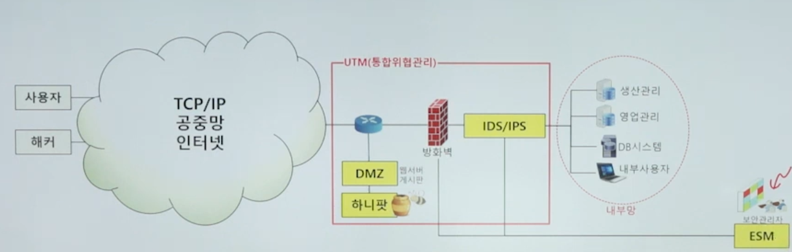

방화벽(firewall)

    내부 네트워크와 외부 네트워크 사이에 위치하여 외부에서의 침입을 1차로 방어해
    사용자의 침입차단을 위한 정책과 이를 지원하는 소프트웨어 및 하드웨어를 제공하는 역할

IDS(Instrusion Detection System)

[자세한 내용](ids.md)
* 침입탐지시스템으로 네트워크에서 사용되는 자원의 무결성, 비밀성, 가용성을 저해하는 비정상적인 사용과 오용, 남용 등의 행위를 가능한한 실시간으로 탐지하여 관리자에게 경고 메시지를 보내주고 대응하는 시스템을 말한다.
* 즉, 외부침입에 대한 정보를 수집하고 분석하여 침입활동을 탐지해 이에 대응하도록 보안 담당자에게 통보하는 기능을 수행하는 네트워크 보안 시스템이다.

IPS

    내부보안 감시 및 능동적 유해 트래픽 차단

DMZ

    DMZ 구간이란 회사 홈페이지처럼 외부에 노출되어있는 서비스를 의미함,
    즉 외부 네트워크에서 DMZ에 접근할 수 있다.
    DMZ 내에는 웹 서버, DNS서버, 메일서버 등이 위치할 수 있다.
    DMZ는 보안 조치가 취해진 네트워크 영역으로, 내부 방화벽과 외부 방화벽 사이에 위치가 가능하다.
    ex) apache, tomcat

UTM(통합위협관리)

    단일 하드웨어, 여러가지 보안기능을 결합시킨 통합장비
    방화벽+IPS+VPN+웹필터링+ANTI-Virus, 스팸차단 등 있다.

    장점: 여러 기능을 하나의 장비에서 처리할수 있고, 네트워크 구성을 심플하게 구성 가능
    단점: 성능 이슈가 있을수 있고 필요 기능별 라이선스 구매로 비용이 증가할수 있다.

[Qos](../../network/qos.md)

ESM

    다양한 이기종간 보안장비 통합, 각 기업이 도입하는 보안솔루션에 대한 중앙집중적인 통합관리 서비스

허니팟(honeypot)

    공격성향이 있는 자들을 중요한 시스템으로부터 다른 곳으로 끌어내도록 설계한 유도 시스템이다.
    관리자가 반응할 수 있도록 공격자로 하여금 시스템에 충분히 오랜 기간 동안 머물수 있도록 유도하고
    공격자의 동작에 관한 정보를 수집한다.

    허니팟의 조건
    1.해커에 쉽게 노출되어야 하며 잠재적으로 공격자를 유혹할 수 있어야함
    2. 대응책을 강구하기에 충분한 시간 동안 공격자가 머무룰수 있게 해야됨
    3. 공격자의 행동패턴에 대한 유용한 정보를 수집가능해야됨
    4. 시스템에 통과하는 모든 패킷을 감시해야된다
    5. 해커가 뚫기 너무 어렵지도 쉽지도 않게 시스템을 만들어야한다.
    6. 시스템에 접속하는 모든 사람에 대한 정보를 관리자에게 알려야 한다.

NGFW[New Generation Firewall](차세대 방화벽)

Anti-DDOS

