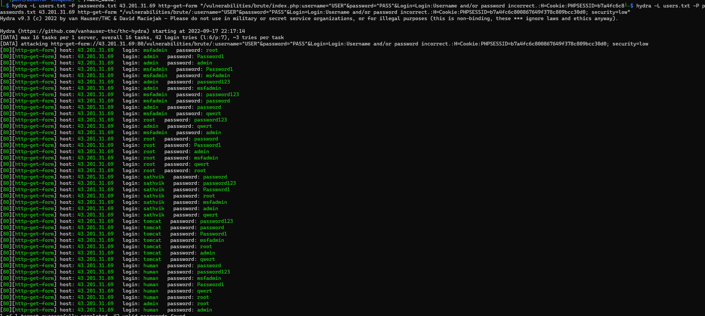
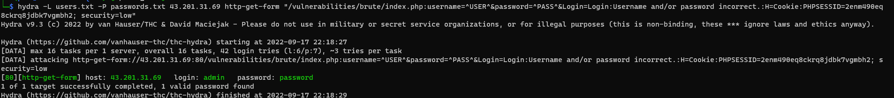

# bruteforce attack이란?

brute force는 무차별 대입을 말한다.   
1000개의 경우의 수가 있고 1개의 답이있으면 1000번 돌려서 답을 찾는 알고리즘을 말한다.  
그것을 이용한 해킹공격을 brute force attack이라 한다.  

    
# bruteforce attack 예제

medusa, hydra, 그외 등 다양한 도구가 있지만   
대표적 bruteforce attack tools 중 하나인 hydra로 함  

    
```bash
hydra -L users.txt -P passwords.txt (ip) http-get-form "/vulnerabilities/brute/index.php:username=^USER^&password=^PASS^&Login=Login:Username and/or password incorrect.:H=Cookie:PHPSESSID=(val); security=low"
```
참고로 위 값을 그대로 입력해도 결과가 달라지거나   
툴이 제대로 작동하지않을수 있음, 특히 form이 환경에 따라 좀 달라지기도 하기에 주의해야됨


# 주의사항

brute force는 값을 잘못입력하면은 결과가 이상하게 나오는데  
이건 보통 세션아이디를 잘못입력하거나 할떄 발생함  



    즉 위는 실패고



    이게 brute force가 잘 작동한 경함

# 대표적으로 대응 방법
1. 일정시간 반복된 로그인 실패 시도시 차단
2. 정해진 로그인 실패 횟수를 초과하면 계정을 잠금
3. 비밀번호 뿐만 아니라 id에 대한 실패 횟수도 정의해 차단
4. 2-factor 인증, OTP 사용, 매크로 프로그램 추가

# 여담 
참고로 지금 쓰는 공격은 bruteforce라 말하긴 힘듬 
단순 예제라서 보기 편하게 password.txt와 id.txt 만든거라
정확하겐 사전 대입 공격(Dictionary Attack)임
어차피 레인보우테이블이나 사전대입 공격으로 경우의 수를 줄여서 공격하는게 현대의 공격기법이다.