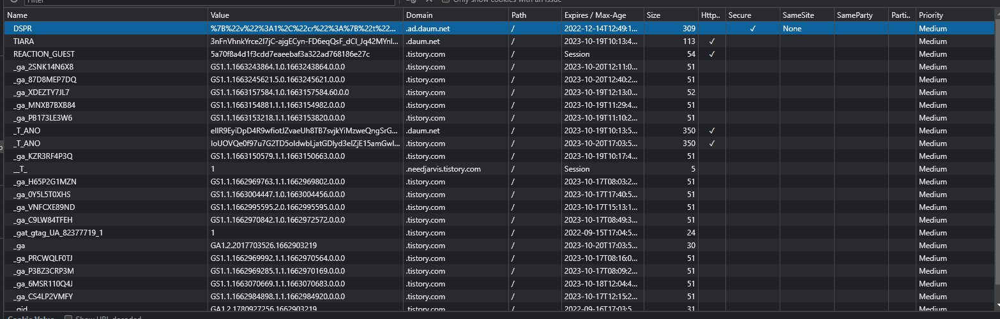

# 쿠키란

    사용자가 인터넷 웹 사이트에 방문할떄 생기는 4KB 이하의 파일을 말함

    쿠기는 웹 사이트를 연결해 주는 정보가 담겨져 있기 때문에 
    나중에 클라이언트가 해당 사이트에 접속하려고 할 때 
    이 쿠키 내용을 이용하여 클라이언트의 신분을 알수 있게 해줌


# 쿠키 통신

    1. 사용자가 웹 사이트에 방문하면 웹 사이트는 사용자의 컴퓨터에 쿠키를 만듬
        즉 이 사이트는 사용자의 브라우저를 확인하는 ID 번호를 쿠키 파일에 넣어서 사용자의 컴퓨터에 저장
    2. 사용자가 웹 서버에 접속할 떄 사용자 컴퓨터에 있는 쿠키를 웹 서버로 전송함
        아이디와 비번을 저장하여 사용한 경우 그 정보에 쿠키에 담겨있어 다시입력하지않아도 로그인 가능하다

# 쿠키의 일반적 용도

    1. 사이트 개인화

    2. 장바구니 시스템
        ex)전ㄴ자상거래에서 주로 사용되는 장바구니 시스템은 사용자가 물건을 고르면 그 내용이 쿠키에 저장됨

    3. 웹 사이트 이용방식 추적

    4. 타깃 마케팅

# 쿠키의 구조 

    Set-Cookie: name=value; expires=[Date]; domain=[Domain]; path=[Path]; [secure]

유효기간(Date)

    유효기간을 지정하면 브라우저가 종료되어도 지정한 기간동안은 쿠키 데이터를 읽고 쓸수 있습니다. 
    유효기간이 지나면 쿠키 데이터는 소멸되며, 실제로 파일이 지워지지 않더라도 데이터를 브라우저에서 읽을수가 없습니다.


도메인(Domain)

    패스 속성을 확정한 것으로 패스가 하나의 사이트에서 쿠키 데이터를 읽고 쓰는 권한을 설정하는 것이라면, 
    도메인 항목은 도메인 단위에서 쿠키데이터를 읽고 쓰는 권한을 설정합니다. 


패스(Path)

    www.aaa.or.kr/bbs/board.html 에서 쿠키를 생성하면 www.aaa.or.kr/bbs/board.html 이외의 페이지에서는 쿠키 데이터를 읽을 수가 없습니다.
    하지만 path를 /bbs로 설정하면 www.aaa.or.kr/bbs 모든 페이지에서 쿠키 데이터를 읽을 수가 있고,
    Path를 /로 지정하면 www.aaa.or.kr 의 모든 페이지에서 쿠키를 읽을수 있습니다.


보안(Secure)

    쿠키 데이터의 전송방법을 지정합니다. 보통은 일반 http를 이용하여 전송하지만, 만일 안전한 전송 방법을 지정하면 https등의 보안 전송 방법을 사용하면 됩니다.  대부분의 경우 쿠키로는 위험하지 않은 데이터를 전달하기 때문에  거의 사용하지 않습니다.





# 쿠키의 보안 속성

httpOnly 속성

    서버에서는 Set-Cookie 응답 헤더를 이용하여 쿠키를 설정하는데, 이 설정을 Set-Cookie에 추가하게 되면 클라이언트의 환경(웹 브라우저)에서 스크립트(Java 등)로 쿠키에 접근하는 것을 차단할 수 있다. 이 설정을 함으로써 XSS(Cross Site Script)공격에 대응이 가능하다

scure 속성

    이 설정 역시 Set-Cookie 응답 헤더에서 설정한다. 클라이언트의 환경(웹 브라우저)에서 HTTPS(SSL/TLS) 통신일 때만 쿠키를 전송하는 방식이다. HTTP를 이용한다면 쿠키를 전송하지 않는다.

    즉, 평문으로 쿠키를 전송하지 않기 때문에 기밀성이 보장되는 방법이다.

# HttpOnly 및 Secure 속성 설정 방법

 Servlet 3.0 환경 : web.xml 파일에 아래 내용 추가

```xml
<session-config>

<cookie-config>

   <http-only>true</http-only>

   <secure>true</secure>

</cookie-config> ... 생략 = cookie.setHttpOnly(true)
```
    

2) 제우스(JEUS) : WEBMain.xml 이나 jeus-web-dd.xml에서 설정

```html
<session-config>

<secure>true</secure>

<http-only>true</http-only>

</session-config>
```
 

3) JBoss

```html
    <Context cookies="true" crossContext="true">

    <SessionCookie secure="true" httpOnly="true">
```

# 쿠키 보안 취약점

XSS(Cross-Site Scripting) 공격

    웹 사이트를 만들기 위해서 HTML언어로 페이지를 구성해야하는데 HTML만으로 정적인 페이지를 만들수가 없다.
    그래서 서버 사이드 스크립트 언어인 PHP, JSP, ASP 등 CGI(Common Gateway Interface) 프로그램을 이용해야된다

    XSS 공격은 자바스크립트가 사용자의 컴퓨터에서 실행된다는 점을 이용한 공격입니다. 자바스크립트에서 "document.cookie"라는 명령어는 사이트에서 쿠키 값을 활용할 수 있게 하는 역할을 하지만 공격자들은 쿠키 값을 탈취하기 위해서 사용하기도 합니다.
    
XSS 대응법


스니핑(Sniffing) 공격

    스니핑이란 단어의 사전적 의미는 '코를 훌쩍이는, 킁킁거리며 냄새를 맡는' 입니다. 사전적 의미와 같이 스니핑 공격은 네트워크의 중간에서 남의 패킷 정보를 도청하는 해킹 유형의 하나입니다. 수동적 공격에 해당하며, 도청할 수 있도록 설치되는 도구를 스니퍼(Sniffer)라고 합니다.

    우리가 웹 페이지에 쿠키를 사용할 경우 서버와 클라이언트는 매번 요청 때마다 쿠키를 주고받게 됩니다. 이때 네트워크 상에 전달되는 쿠키가 스니핑 공격에 의해서 탈취당할 수 있습니다.


공용 PC에서 쿠키값 유출

    쿠키는 사용자의 하드디스크에 저장되기 때문에 공용 PC인 경우 쿠키를 쉽게 탈취할 수 있습니다. 사용자 개인이 주의해서 사용해야 할 문제인 것 같습니다.


HTML5 웹 스토리지 정보 유출
