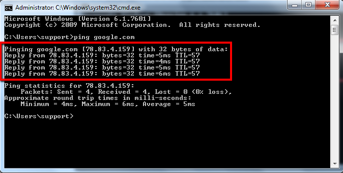

# ping이란?

* 종단(end) 노드 간에 네트워크 상태를 관리하기 위한 명령어
*  인터넷으로 접속하려는 원격 호스트가 정상적으로 운영되고 있는지를 확인하는 진단 목적으로 사용
* ICMP를 이용한 유틸리티
*  ICMP 타입 중에서 Echo Request(Type 8) 타입을 지정하여 대상 시스템으로 ICMP 패킷을 전송하과, 그 대상 시스템으로부터 Echo Reply(Type 0) 패킷을 수신함으로써 접근성 확인
* 네트워크 속도 측정, 시스템 상의 IP 주소 알아냄

# 주의사항

서버에 따라 해킹이나 간접 부하를 줄이기 위해 ping 명령에 응답하지 않도록 설정하는 경우가 있다.

# 팁

* 유닉스 계열 서버면 TTL(Time To Live)가 255 
    * 200번 정도면 유닉스 서버로 추축 가능
* 윈도우 계열은 128
    * 100번 정도면 윈도우 계열로 유추 가능


# 간단한 명령어

* window ping command
    * -n:패킷 전송 횟수 설정(default: 4)
    * -l: 패킷 크기(bytes) 설정(default: 32 bytes)

* linux ping command
    * ping [-option] ip_address | host_name
        * -c (count): 패킷 송수신 횟수 설정(default: unlimited)
        * -s (packet_size): ICMP 송신 패킷 크기(bytes) 설정(default 56 bytes)
        * -i (wait): ICMP 패킷 송신 간의 대기시간 (Default 1sec) 
```bash
ping 192.168.0.100
ping www.google.com -s 100 -c 10
```

# 실행
## window


## Linux


# 패킷 전송 이미지

