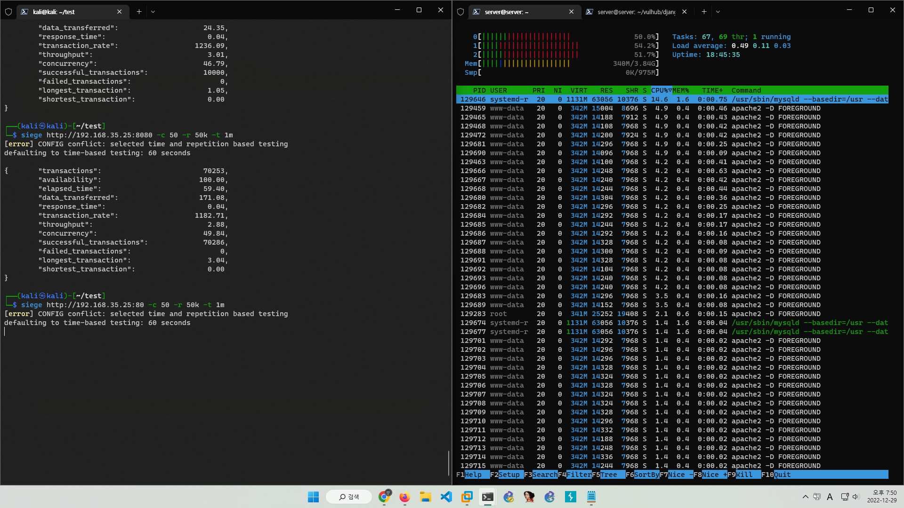

# siege
서버 부하 테스트로 어떻게 보면 도스공격인데 주 목적은 서버 부하 테스트이다.  
주로 사용자를 어느정도 정하여 서버의 부하를 테스트하여 서버가 안정적으로 돌아가는지, 장비에 이상이 생기진 않는지, 솔루션들이 잘 작동하는지, 얼마나 자원을 필요로 하는지 등 이러한 시스템을 테스트하기 간단하게 하기위해 만들어졌다.    
남의 서버에 이러한 시스템적 공격을 해서는 안되며 이것또한 허가되지 않는 사용자에게 사용시에 법적 처벌을 피할수 없으니 주의해서 사용하길 바란다.  


잘 작동하는것을 확인할수있다.  딱 봐도 알겠지만 그래도 이 스크립트에 대해 설명하자면은

``` bash
siege http://192.168.35.25:80 -c 50 -r 50k -t 1m
```

# 위 옵션 설명
-c : 스트레스 테스트에서 시뮬레이션할 동시 사용자 수를 지정합니다.
-r : 웹 응용프로그램으로 요청을 보내는 속도를 지정합니다. 
-t : 이 옵션은 스트레스 테스트 기간을 지정합니다. 

50 명의 동시 사용자를 시뮬레이션합니다.  
초당 50,000개의 요청 속도로 요청을 전송합니다.
1분 동안 실행됩니다.

즉 50명이 초당 50000bytes의 요청을 초당으로 요청하는것을 1분동안 실행하는 시뮬레이션을 돌리는거라 보면된다.  
[더 자세한 옵션](https://www.kali.org/tools/siege/)

# 마즈막
이 스크립트를 사용하여 남의 서버의 부하를 걸어서 서버가 다운되고나 접속장애가 발생하게 하는 행위는 심각한 범죄 행위이다.  
물론 디도스 솔루션으로 이정도 프로그램으로 단일 사용자가 대기업을 다운시킬순 없겠지만 그럼에도 범죄행위니 반드시 자신이나 허가된 서버에만 사용하길 바란다. 