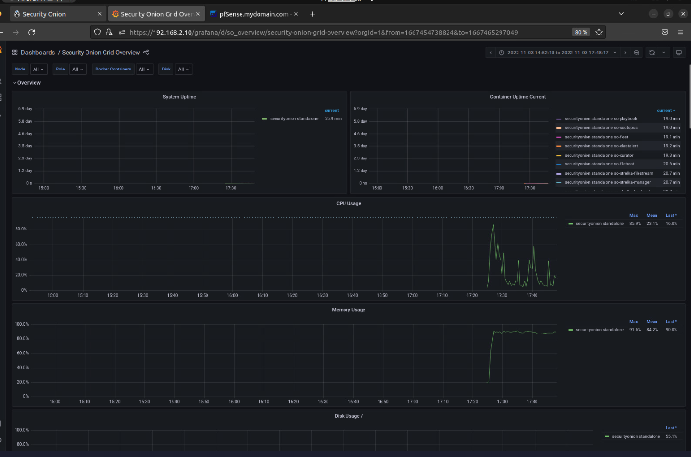

# Security Onion

통합 IDS라고도 할 수 있다.  
공식사이트에서 설명하길 위협감지, 네트워크 모니터링, 로그 관리를 할수있는 보안  통합솔루션이라 말한다.  
pfsense보다 한층 더 복잡하고 정교한 로그 모니터링을 할 수 있으며 다양한 그래프를 보여준다.  
Suricata, Zeek, Wazuh, the Elastic Stack과 다른 확장 기능들도 지원하고 추가도 가능하다.  
한마디로 Security Onion은 한층 더 정교한 모니터링과 로그 분석을 도와줄수 있게 해주는 보안 운영체제이며  
클라우드가 아니라면은 무료로 사용이 가능하며 security Onion github에서 소통이 활발하게 일어나고 있다.
이것을 활용하여 SIEM을 구축해서 효과적인 모니터링을 가능하게 해준다. 당연하겠지만 요즘 클라우드가 대세기에 클라우드에서도 Security Onion을 지원한다  
뿐만 아니라 머신러닝 기능도 지원해서 APT 공격을 한층 더 효과적으로 방어할수 있게 해준다.  

# Security Onion 화면

