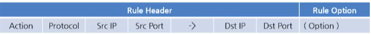

# Snort Rule 구조

Src/Dst IP Port: 출발지, 목적지 ip와 포트를 적음

<>,-> : 패킷의 방향을 나타냄

(Option): 매칭되는 케이스를 상세하고 명확하게 조작이 가능

# Action

Action: 룰이 매칭 됐을때 수행할 Alert, Pass, Drop 등을 수행할 다양한 액션을 선택하여 넣음

| 종류 | 내용|
| --- | --- |
| Alert | 패킷의 정보를 로그에 기록화하고 사용자가 확인할 수 있도록 경고를 발생시킴|
| Log | 패킷의 정보를 설정한 로그 파일에 기록함|
| Pass | 패킷을 무시, 특정한 네트워크의 트래픽을 무시하고싶을때 사용함 (Bypass 라고도 함) |
| Drop | In_Line 방식으로 구성되어 있을 경우 IPS 역할이 가능함   규칙에 매칭되는 패킷을 차단하고 기록함|
| Reject | Drop과 같은 액션을 취함   TCP의 REST 패킷을 출발지로 전송   ICMP 패킷은 Unreachable로 반송시킴|
| Sdrop | Drop과 동일하게 패킷을 차단하지만 로그 기록을 하지 않음 |

# Protocol

Protocol: ip, tcp, udp, icmp, any 등을 프로토콜로 표시

TCP, UDP, ICMMP, IP, ANY 등 프로토콜 타입을 선택할 수 있음

# Rule Header (Src/Dst IP)

Snort.cond 

| 종류 | 내용 |
| --- | --- |
| ! | 부정 연산자로 특정 네트워크 대역을 제외|
| [] | 비연속적인 아이피를 지정|
| any | 모든 아이피를 의미|
| 192.168.100.50/32 | 특정 호스트 아이피를 지정함|
| 192.168.100.0/24 | 특정 아이피 대역대를 지정함|
| !192.168.100.0/24 | 전체 아이피에서 특정 아이피 대역대를 제외함|
| $EXTERNAL_NET | 외부 아이피 주소 변수 |
| $HOME_NET | 내부 아이피 주소 변수 |
| $HTTP_SERVERS | 웹 서버의 주소 변수 |
| $DNS_SERVERS | DNS 서버의 아이피 주소 변수|
| $SMTP_SERVERS | SMTP 메일 서버의 아이피 주소 변수|
| $SSH_SERVERS | SSH 프로토콜을 사용하는 장비의 아이피 주소 변수|

# Rule Header (Src/Dst Port)

| 종류 | 내용 |
| --- | --- |
| ! | 부정 연산자로 특정 포트를 제외|
| : | 연속적인 포트번호를 지정함|
| any | 모든 포트를 의미함|
| !1:1000| 1부터 1000까지를 제외한 포트를 지정함|

| 종류 | 내용 |
| --- | --- |
| -> | 송신지에서 수신지로 향함을 의미함 |
| <> | 송신지에서 수신지의 오가는 패킷을 의미함 |

# option

## content

| 종류 | 내용 |
| --- | --- |
| content | 트래픽중 특정한 내용을 잡아서 action을 취할수 있게 해주는 옵션 |
| offset | 페이지의 시작을 알리는 옵션|
| depth | 페이지의 끝을 알리는 옵션|
| http_header | content에서 http_header 옵션으로 검색내용을 제한하라|
| http_client_body | content에서 http_client_header 옵션으로 웹 요청(POST) 부분을 제한| 
| http_uri| 패킷 검사 범위를 URI로 제한|
| nocase | 대소문자를 구분하지 않음 |

URI: URL과 URN을 포함한 하나의 집합 즉 `웹 서비스 페이지의 주소 + 쿼리를 포함한 주소`

## other option

| 종류 | 내용 |
| --- | --- |
| refernce | 어떤 내용을 참조했냐 나타내는 구문|
| fast_pattern | 

## classtype

| 종류 | 내용 |
| --- | --- |
|classtype| 탐지된 룰이 어느 타입에 속하는지 의미함|
| sid | Signature ID|
| rev | 룰의 버전을 나타냄 sid가 같은 룰이 존재할경우 snort에서 자동으로 rev가 높은것을 선택   이렇게 하는 이유는 룰이 자동으로 추가되는데 기존 룰을 삭제하거나  새로운 룰에 sid를 다르게 매기기엔 어려운 상황이 많아서 그렇다.|
|metadata| 룰을 만든 날짜와 수정한 날짜|

## flow

| 종류 | 내용 |
| --- | --- |
| flow | 통신 흐름에 대한 옵션|

ex) flow:established,to_client;

실제 tcp 3way handshaking이 성공할 시에 어떤것을 하라는 것을 지정하고싶을떄

### sid
0 ~ 1000000: SourceFire VRT에서 받아오는 시그니처에 할당된 SID 

2000000 ~ 2999999: Emerging Threats에서 받아오는 시그니처에 할당된 sid값

3000000 ~: 원하는 대로 사용 가능한 영역