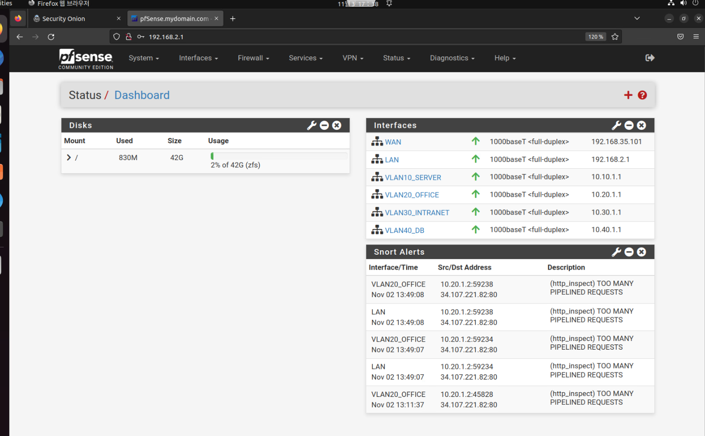

# Pfsense란?
무/유료 버전이 있는 오픈소스 방화벽, 라우터, IDS, IPS등 거의 UTM에 가까운 시스템이다.

최근엔 클라우드에서도 사용할수 있으며 기본적으로 오픈소스기에 많은 기업들이 사용하고 

실제 판매 장비에도 내장되는 등 다양하게 사용이 가능하다.

오픈소스기에 실제 코드도 볼 수 있다. -> [PFSENSE](https://github.com/pfsense/pfsense.git)

다른 장비들과 마찬가지로 서버를 만들어서 거기에 특정 호스트들이 들어가게 한다음 수정하는 식으로 작동한다.  

FreeBSD 기반으로 만들어졌으며 웹은 php기반이다.

# pfsense의 webgui
