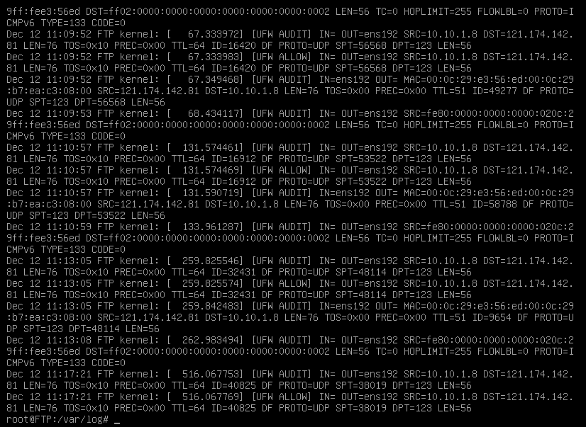

# ufw logging level

ufw에는 로깅레벨이 있다. off, low, medium, hight, full이 있는데
통상적으로 medium 이상의 레벨은 로그가 상당한 수준으로 발생하기에  
주의할 필요가 있다. 
자신의 장비의 사양, 목적에 맞게 알맞은 로깅레벨을 지정하자.

* off: No logging is performed.
* low: Only basic information about allowed and denied packets is logged.
* medium: In addition to the information logged at the low level, information about new connections and closed connections is also logged.
* high: In addition to the information logged at the medium level, detailed information about each packet is also logged.
* full: All available information about each packet is logged. This is the most verbose logging level.

# log frame


``` bash
[2022-12-12 13:37:00] [UFW BLOCK] IN=eth0 OUT= MAC=aa:bb:cc:dd:ee:ff SRC=192.168.1.100 DST=192.168.1.200 LEN=40 TOS=0x00 PREC=0x00 TTL=64 ID=32002 DF PROTO=TCP SPT=59772 DPT=22 WINDOW=1024 RES=0x00 SYN URGP=0
```




# logging setting

``` bash
ufw logging medium 
```